## Chapter 1: Introduction

### Object Space vs. Image Space

| Space | Description |
|---|---|
| **Object Space** | Continuous abstract space where shapes are defined using coordinates |
| **Image Space** | Discrete pixel grid (display monitor) where the image is produced |

### Key Areas

- **Geometric Representation** — defining objects using coordinates (vertices, etc.)
- **Transformation** — mapping objects to image space using matrices (controls position, orientation, size)
- **Scan Conversion** — converting continuous figures to discrete pixels (rasterization)
- **Anti-aliasing** — reducing the "staircase" distortion caused by scan conversion

### 2D Graphics Pipeline

$$\text{Object Coordinates} \rightarrow \text{World Coordinates} \rightarrow \text{Device Coordinates}$$

### 3D Graphics Concepts

- **Projection** — mapping 3D objects onto a 2D display surface
- **Hidden Surface Removal** — hiding surfaces obscured from the viewer
- **Illumination & Shading** — simulating light reflection for realism
  - *Local illumination* — direct light only
  - *Global illumination* — includes reflected light and transparency

### Allied Fields

- **Image Processing** — pixel-based operations on existing images (not synthesizing from scratch)
- **Computer-Human Interaction** — interfaces and logical input devices

---

## Chapter 2: Image Representation

### Digital Image Basics

| Term | Definition |
|---|---|
| **Resolution** | Number of pixels per unit length (e.g., pixels per inch) |
| **Aspect Ratio** | Width ÷ Height (e.g., 1920 × 1080 → 16:9) |

### Color Models

#### RGB (Additive — for displays)
$$\text{Color} = (R, G, B), \quad R, G, B \in [0, 1]$$
- Black = (0,0,0), White = (1,1,1)
- The **gray axis** is the diagonal from black to white

#### CMY (Subtractive — for printers)
$$C = 1-R, \quad M = 1-G, \quad Y = 1-B$$

---

### Image Representation Methods

#### Direct Coding
Each pixel stores actual color values.

| Type | Bits/pixel | Colors |
|---|---|---|
| Binary (B&W) | 1 | 2 |
| Grayscale | 8 | 256 |
| True color (RGB) | 24 | ~16.7 million |

#### Lookup Table (Color Map)
Each pixel stores an **index** into a color table.

- 8-bit pixel → 256-entry table, each entry = 24-bit RGB
- **Memory formula:** `Entries × 3 bytes`
  - Example: 2-byte pixel → 65,536 entries → 65,536 × 3 = **196,608 bytes**

---

### Output Devices

#### CRT Monitors
- Electron guns strike phosphor-coated screen → emits light
- Requires refresh (~60 Hz) to avoid flicker
- Uses 3 guns (R, G, B) with shadow masks

#### Printers (CMYK)
- Paper is white; ink **subtracts** light
- Black ink used separately (cheaper, better quality than mixing C+M+Y)

**Techniques to simulate shades:**

| Technique | Method | Resolution |
|---|---|---|
| **Halftoning** | Varies dot size in a grid | Reduced |
| **Dithering** | Threshold matrix decides pixel ON/OFF | Preserved |
| **Error Diffusion** | Spreads rounding error to neighbors | Preserved |

**Dithering rule:** Pixel ON if `ImageIntensity(x,y) > D_n(i,j)`, where `i = x mod n`, `j = y mod n`

**Error Diffusion (Floyd-Steinberg):** Distributes quantization error to unprocessed neighbors → smooth gradients without banding.

---

### Image Files

- Structure: **Header** (format, dimensions) + **Image Data**
- Compression: **Run-Length Encoding (RLE)** — e.g., `AAAAAABBBCC` → `(A,6),(B,3),(C,2)`

---

### Exam Math

---

#### Q1a: What is quantization?

Quantization is the process of mapping a continuous range of values into a smaller, finite, discrete set. In image representation, it means converting continuous light intensities into discrete digital values — for example, mapping analog color intensity to an 8-bit value in the range 0–255.

---

#### Q1b: Maximum memory for 10 images using direct coding (640×520 pixels, 3 bytes/pixel)?

**Given:**
- Image dimensions: 640 × 520 pixels
- Color depth: 3 bytes per pixel (1 byte each for R, G, B)
- Number of images: 10

**Step 1 — Total pixels per image:**
$$640 \times 520 = 332{,}800 \text{ pixels}$$

**Step 2 — Memory per image:**
$$332{,}800 \text{ pixels} \times 3 \text{ bytes/pixel} = 998{,}400 \text{ bytes}$$

**Step 3 — Total memory for 10 images:**
$$998{,}400 \times 10 = \boxed{9{,}984{,}000 \text{ bytes}}$$

Converting: $9{,}984{,}000 \div 1024 = 9{,}750 \text{ KB} \approx 9.52 \text{ MB}$

---

#### Q1c: How many colors can be stored in a lookup table if each image's index memory must not exceed 500 KB?

**Given:**
- Image size: 640 × 520 = 332,800 pixels (from Q1b)
- Memory limit per image: 500 KB
- Goal: find maximum number of bits per pixel for the index, then find the number of colors

**Step 1 — Convert 500 KB to bytes:**
$$500 \times 1024 = 512{,}000 \text{ bytes}$$

**Step 2 — Convert bytes to bits:**
$$512{,}000 \times 8 = 4{,}096{,}000 \text{ bits}$$

**Step 3 — Calculate available bits per pixel:**
$$\frac{4{,}096{,}000 \text{ bits}}{332{,}800 \text{ pixels}} \approx 12.307 \text{ bits/pixel}$$

**Step 4 — Round down to a whole number (must be integer bit depth):**
$$\lfloor 12.307 \rfloor = 12 \text{ bits/pixel}$$

*(We round down, not up, to stay within the 500 KB limit.)*

**Step 5 — Calculate number of representable colors:**
$$2^{12} = \boxed{4{,}096 \text{ colors}}$$

---

#### Bonus Q: If 2-byte pixel values are used in a 24-bit lookup table, how many bytes does the lookup table occupy?

**Given:**
- Pixel size: 2 bytes = 16 bits → used as an index
- Each LUT entry: 24-bit color = 3 bytes

**Step 1 — Number of LUT entries (one per possible index value):**
$$2^{16} = 65{,}536 \text{ entries}$$

**Step 2 — Size of each entry:**
$$24 \text{ bits} \div 8 = 3 \text{ bytes per entry}$$

**Step 3 — Total LUT size:**
$$65{,}536 \times 3 = \boxed{196{,}608 \text{ bytes}}$$

---

## Chapter 3: Scan Conversion

### Scan-Converting a Point

$$X_{pixel} = \lfloor x + 0.5 \rfloor, \quad Y_{pixel} = \lfloor y + 0.5 \rfloor$$

**Example:** Map continuous point $(10.3,\ 20.7)$ to a pixel.

**Step 1 — Add 0.5 to each coordinate:**
$$x + 0.5 = 10.3 + 0.5 = 10.8$$
$$y + 0.5 = 20.7 + 0.5 = 21.2$$

**Step 2 — Apply floor:**
$$X_{pixel} = \lfloor 10.8 \rfloor = 10, \quad Y_{pixel} = \lfloor 21.2 \rfloor = 21$$

**Result:** Pixel plotted at $(10,\ 21)$

---

### Line Drawing Algorithms

#### 1. Slope-Intercept Method (y = mx + b)

**Steps:**
1. Compute slope: $m = \frac{y_2 - y_1}{x_2 - x_1}$
2. Compute y-intercept: $b = y_1 - m \cdot x_1$
3. For each integer $x$ from $x_1$ to $x_2$: compute $y = mx + b$, round to nearest integer, plot $(x, \text{round}(y))$

**Example — Line from (2, 3) to (6, 5):**

**Step 1 — Calculate slope:**
$$m = \frac{5 - 3}{6 - 2} = \frac{2}{4} = 0.5$$

**Step 2 — Calculate y-intercept:**
$$b = y_1 - m \cdot x_1 = 3 - (0.5 \times 2) = 3 - 1 = 2$$

**Step 3 — Iterate and compute y for each x** (using $y = 0.5x + 2$):

| $x$ | Calculation | $y$ (float) | $\text{round}(y)$ | Plot |
|---|---|---|---|---|
| 2 | $0.5(2) + 2 = 1 + 2$ | 3.0 | 3 | (2, 3) |
| 3 | $0.5(3) + 2 = 1.5 + 2$ | 3.5 | 4 | (3, 4) |
| 4 | $0.5(4) + 2 = 2 + 2$ | 4.0 | 4 | (4, 4) |
| 5 | $0.5(5) + 2 = 2.5 + 2$ | 4.5 | 5 | (5, 5) |
| 6 | $0.5(6) + 2 = 3 + 2$ | 5.0 | 5 | (6, 5) |

| ✅ Advantage | ❌ Disadvantage |
|---|---|
| Simple to understand | Floating-point multiplication every pixel |
| Direct calculation | Visual gaps when $m > 1$ |

---

#### 2. DDA (Digital Differential Analyzer)

**Steps:**
1. Compute differences: $dx = x_2 - x_1$, $dy = y_2 - y_1$
2. Determine step count: $\text{step} = \max(|dx|, |dy|)$ — ensures no gaps regardless of slope
3. Compute per-step increments: $x_{inc} = dx / \text{step}$, $y_{inc} = dy / \text{step}$
4. Initialize: $x = x_1$, $y = y_1$
5. For each iteration: plot $(\text{round}(x), \text{round}(y))$, then $x = x + x_{inc}$, $y = y + y_{inc}$

**Example — Line from (2, 3) to (6, 5):**

**Step 1 — Compute differences:**
$$dx = 6 - 2 = 4, \quad dy = 5 - 3 = 2$$

**Step 2 — Determine step count:**
$$\text{step} = \max(|4|, |2|) = \max(4, 2) = 4$$

**Step 3 — Compute increments:**
$$x_{inc} = \frac{4}{4} = 1.0, \quad y_{inc} = \frac{2}{4} = 0.5$$

**Step 4 — Initialize:** $x = 2.0,\ y = 3.0$

**Step 5 — Iterate** (at each step: plot → add increments):

| Iter | $x$ | $y$ | $\text{round}(x)$ | $\text{round}(y)$ | Plot | $x_{next}$ | $y_{next}$ |
| Iter | $x$ | $y$ | $x_{next}$ | $y_{next}$ | $\text{round}(x)$ | $\text{round}(y)$ | Plot |
|---|---|---|---|---|---|---|---|
| 0 | 2.0 | 3.0 | $2.0+1.0=3.0$ | $3.0+0.5=3.5$ | 2 | 3 | **(2,3)** |
| 1 | 3.0 | 3.5 | $3.0+1.0=4.0$ | $3.5+0.5=4.0$ | 3 | 4 | **(3,4)** |
| 2 | 4.0 | 4.0 | $4.0+1.0=5.0$ | $4.0+0.5=4.5$ | 4 | 4 | **(4,4)** |
| 3 | 5.0 | 4.5 | $5.0+1.0=6.0$ | $4.5+0.5=5.0$ | 5 | 5 | **(5,5)** |
| 4 | 6.0 | 5.0 | — | — | 6 | 5 | **(6,5)** |

| ✅ Advantage | ❌ Disadvantage |
|---|---|
| No multiplication | Still uses floating-point |
| No gaps in line | Cumulative rounding error on long lines |

---

#### 3. Bresenham's Line Algorithm (Integer Only)

**Steps (for $m < 1$):**
1. Compute: $dx = x_2 - x_1$, $dy = y_2 - y_1$
2. Pre-compute constants: $2dy$ and $2dy - 2dx$
3. Initialize: $x = x_1$, $y = y_1$, $P_0 = 2dy - dx$
4. At each step: plot $(x, y)$, increment $x = x + 1$, then:
   - If $P_n < 0$: $y$ stays, $P_{n+1} = P_n + 2dy$
   - If $P_n \geq 0$: $y = y + 1$, $P_{n+1} = P_n + 2dy - 2dx$
5. Repeat until $x = x_2$

**Example — Line from (2, 3) to (6, 5):**

**Step 1 — Compute differences:**
$$dx = 6 - 2 = 4, \quad dy = 5 - 3 = 2$$

**Step 2 — Pre-compute constants:**
$$2dy = 2 \times 2 = 4$$
$$2dy - 2dx = 4 - 2(4) = 4 - 8 = -4$$

**Step 3 — Initial decision variable:**
$$P_0 = 2dy - dx = 4 - 4 = 0$$

**Step 4 — Initialize:** plot $(2, 3)$, then iterate:

| Step | x | y | $x_{next}$ | Action   | $y_{next}$ | p  | $p_{next}$ |
|------|---|---|-------|----------|-------|----|-------|
| 0    | 2 | 3 | 3     | y++      | 4     | 0  | -4    |
| 1    | 3 | 4 | 4     | y stays  | 4     | -4 | 0     |
| 2    | 4 | 4 | 5     | y++      | 5     | 0  | -4    |
| 3    | 5 | 5 | 6     | y stays  | 5     | -4 | —     |

**Plotted pixels:** (2,3), (3,4), (4,4), (5,5), (6,5)


**Final pixels plotted:** $(2,3),\ (3,4),\ (4,4),\ (5,5),\ (6,5)$

**For $m \ge 1$ (steep lines):**
- The roles of $x$ and $y$ swap compared to $m < 1$.
- Increment $y$ each step, and decide whether to increment $x$ based on $P$.
- Initial $P_0 = 2dx - dy$.
- If $P < 0$: $x$ stays, $P = P + 2dx$.
- If $P \ge 0$: $x$ increments, $P = P + 2dx - 2dy$.
**Memory tip:** When slope flips, $dx$ and $dy$ swap in the formulas.

| ✅ Advantage | ❌ Disadvantage |
|---|---|
| Integer-only (fastest) | More complex to implement for all slopes |
| No rounding needed | Different cases needed for $m>1$, negatives |

---

### Circle & Ellipse Drawing

#### 8-Way Symmetry (Circles)
Compute one octant ($x \leq y$), mirror to get 8 points:

| Octant | Transform | Pixel (from point (2,5)) |
|---|---|---|
| 1 | $(x, y)$ | (2, 5) |
| 2 | $(y, x)$ | (5, 2) |
| 3 | $(-y, x)$ | (−5, 2) |
| 4 | $(-x, y)$ | (−2, 5) |
| 5 | $(-x, -y)$ | (−2, −5) |
| 6 | $(-y, -x)$ | (−5, −2) |
| 7 | $(y, -x)$ | (5, −2) |
| 8 | $(x, -y)$ | (2, −5) |

> Ellipses use **4-way symmetry** only — $x$ and $y$ cannot be swapped.

**Performance gain:** 87.5% fewer calculations for circles; 75% for ellipses.

---

#### Bresenham's Circle Algorithm

**Initialize:** $x = 0$, $y = r$, $d_0 = 3 - 2r$

**At each step (while $x \leq y$):**
- Plot 8 symmetric points for current $(x, y)$
- If $d < 0$: $y$ stays, $d = d + 4x + 6$
- If $d \geq 0$: $y = y - 1$, $d = d + 4x - 4y + 10$
- Always: $x = x + 1$

**Example — Circle with $r = 5$, centered at $(0,0)$:**

**Step 1 — Initialize:**
$$x = 0, \quad y = 5$$
$$d_0 = 3 - 2(5) = 3 - 10 = -7$$

**Step 2 — Iterate** (note: $d$ update uses $x$ and $y$ values *before* incrementing):

| Step | x | y |  $x_{next}$ | Action | $y_{next}$ | d | $d_{next}$ |
|------|---|---|--------|--------|--------|----|--------|
| Init | 0 | 5 | 1      | d < 0  | 5      | -7 | -1     |
| 1    | 1 | 5 | 2      | d < 0  | 5      | -1 | 9      |
| 2    | 2 | 5 | 3      | d >= 0 | 4      | 9  | 7      |
| 3    | 3 | 4 | 4      | d >= 0 | 3      | 7  | 13     |

*Stop: next $x = 5 > y = 3$, so first octant is complete.*

**Points computed** $(x, y)$: $(0,5), (1,5), (2,5), (3,4), (4,3)$ — each is mirrored using 8-way symmetry to produce the full circle.

---

#### Midpoint Circle Algorithm

**Initialize:** $x = 0$, $y = r$, $p_0 = 1 - r$

**At each step (while $x \leq y$):**
- Plot 8 symmetric points for current $(x, y)$
- If $p < 0$: $y$ stays, $p = p + 2x + 3$
- If $p \geq 0$: $y = y - 1$, $p = p + 2x - 2y + 5$
- Always: $x = x + 1$

**Example — Circle with $r = 5$, centered at $(0,0)$:**

**Step 1 — Initialize:**
$$x = 0, \quad y = 5$$
$$p_0 = 1 - r = 1 - 5 = -4$$

**Step 2 — Iterate** (note: $p$ update uses $x$ and $y$ values *before* incrementing $x$, but *after* decrementing $y$ when applicable):

| Step | x | y |  $x_{next}$ | Action | $y_{next}$ | p | $d_{next}$ |
|------|---|---|--------|--------|--------|----|--------|
| Init | 0 | 5 | 1      | p < 0  | 5      | -4 | -1     |
| 1    | 1 | 5 | 2      | p < 0  | 5      | -1 | 4      |
| 2    | 2 | 5 | 3      | p >= 0 | 4      | 4  | 3      |
| 3    | 3 | 4 | 4      | p >= 0 | 3      | 3  | 6      |

*Stop: next $x = 5 > y = 3$, first octant complete.*

**Points computed:** $(0,5),\ (1,5),\ (2,5),\ (3,4),\ (4,3)$ — mirrored using 8-way symmetry.

> Midpoint is more adaptable than Bresenham's Circle — it is the standard method used for ellipses. For ellipses, split the curve into two regions at the point where slope $= -1$.

---

### Scan-Converting Characters (Fonts)

#### Bitmap (Raster) Fonts
- Store characters as pre-calculated binary grids
- Rendering = copy grid to screen memory (BitBlt)

| ✅ Advantage | ❌ Disadvantage |
|---|---|
| Extremely fast | Blocky when scaled |
| Pixel-perfect at native size | Separate file per size needed |

#### Outline (Vector) Fonts (e.g., TrueType, OpenType)
- Store mathematical curves (Bézier) and lines
- Rendering pipeline: **Fetch geometry → Transform → Rasterize boundary → Scanline fill → Hint**

| ✅ Advantage | ❌ Disadvantage |
|---|---|
| Infinitely scalable | Computationally expensive |

| Single file for all sizes | Blurry at small sizes without hinting |

---

### Scan-Converting Arcs, Sectors, Rectangles

#### Arcs
Three approaches:
1. **Trigonometric:** $x = h + r\cos\theta$, $y = k + r\sin\theta$ — accurate but slow (uses sin/cos)
2. **Polynomial:** $y = \sqrt{r^2 - x^2}$ — uses square roots, no symmetry
3. **Bresenham (avoid for arcs):** Must compute entire circle then check bounds — inefficient, risks infinite loop

#### Sectors (Pie Slice)

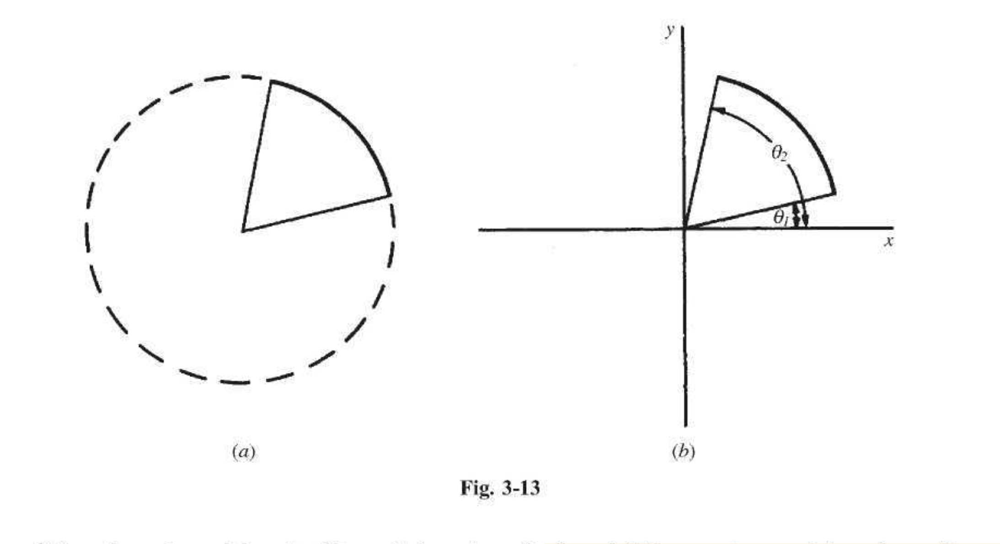

**Fig. 3-13:** Scan-converting a sector (pie slice): (a) shows the arc and sector, (b) shows the angles and endpoints used for filling.
1. Draw arc from $\theta_1$ to $\theta_2$
2. Calculate endpoints: $(h + r\cos\theta_1,\ k + r\sin\theta_1)$ and $(h + r\cos\theta_2,\ k + r\sin\theta_2)$
3. Draw two lines from center to each endpoint (use Bresenham's line)

#### Rectangle (Axis-aligned)

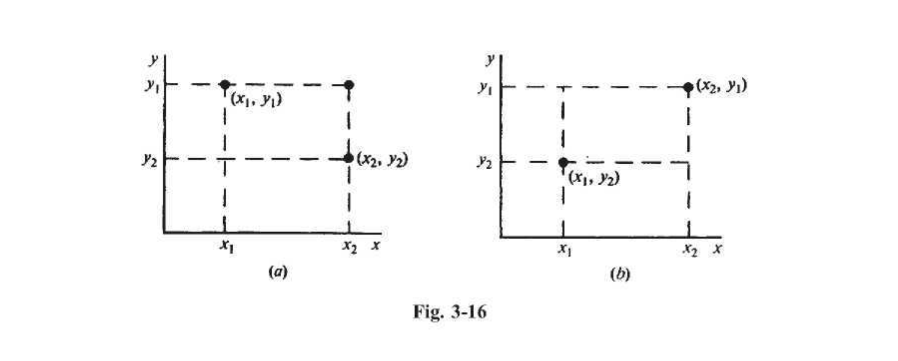

**Fig. 3-16:** Scan-converting a rectangle: (a) and (b) show how the four corners are used to define the rectangle for filling or drawing edges.
- Input: two opposite corners $(x_1, y_1)$ and $(x_2, y_2)$
- Derive: $(x_1, y_2)$ and $(x_2, y_1)$
- Draw 4 edges using any line algorithm

---


### Region Filling

**Interior-defined region:** A region where filling begins from a seed point inside the boundary and continues outward until the boundary is reached.


**Boundary-defined region:** A region enclosed by a specific boundary color, where filling begins from a seed point inside the area and continues outward pixel-by-pixel until the specific boundary color is reached.

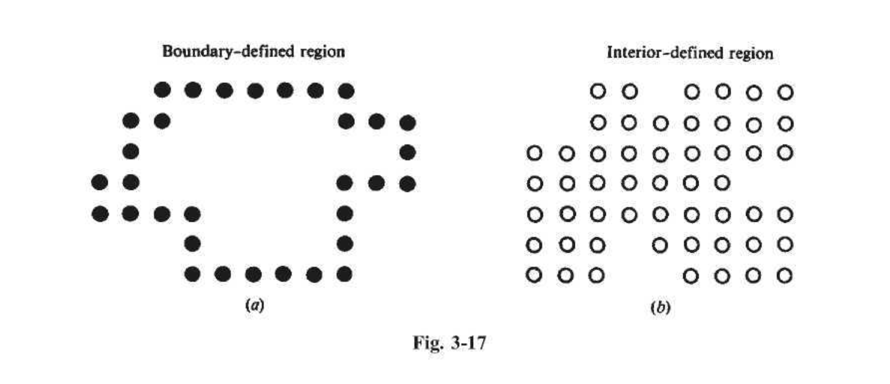

**Fig. 3-17:** (a) Boundary-defined region: filling is constrained by a boundary color. (b) Interior-defined region: filling spreads outward from a seed point until the boundary is reached.

#### Pixel Connectivity

| Type | Neighbors |
|---|---|
| **4-Connected** | Up, Down, Left, Right only |
| **8-Connected** | All 8 surrounding pixels (includes diagonals) |

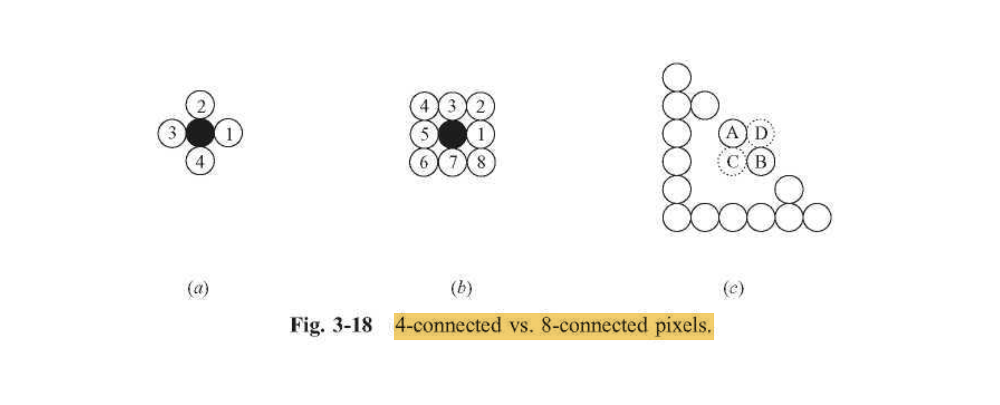

**Fig. 3-18:** (a) 4-connected neighbors: only up, down, left, right. (b) 8-connected neighbors: includes diagonals. (c) Example showing how connectivity affects region filling.

> **Critical rule:** If boundary is 8-connected → fill must be 4-connected, and vice versa (prevents leaking).

---

#### 1. Boundary-Fill (Recursive)
Used when region is enclosed by a specific **boundary color**.

**Steps:**
1. Start at seed pixel
2. If pixel = fill color OR boundary color → stop
3. Else: paint pixel with fill color, recurse on neighbors

| ✅ Advantage | ❌ Disadvantage |
|---|---|
| Works on irregular shapes | Stack overflow on large regions |
| Easy to implement | Fails if boundary is multi-colored |

---

#### 2. Flood-Fill (Recursive)
Used when region is defined by a uniform **interior color** (e.g., paint bucket tool).

**Steps:**
1. Start at seed, record `Old_Color`
2. If pixel ≠ `Old_Color` OR already = `New_Color` → stop
3. Else: paint with `New_Color`, recurse on neighbors

| ✅ Advantage | ❌ Disadvantage |
|---|---|
| No boundary color needed | Stack overflow risk |
| Natural stopping condition | Cannot fill gradients |

---


#### 3. Scanline Fill (Optimized Polygon Fill)

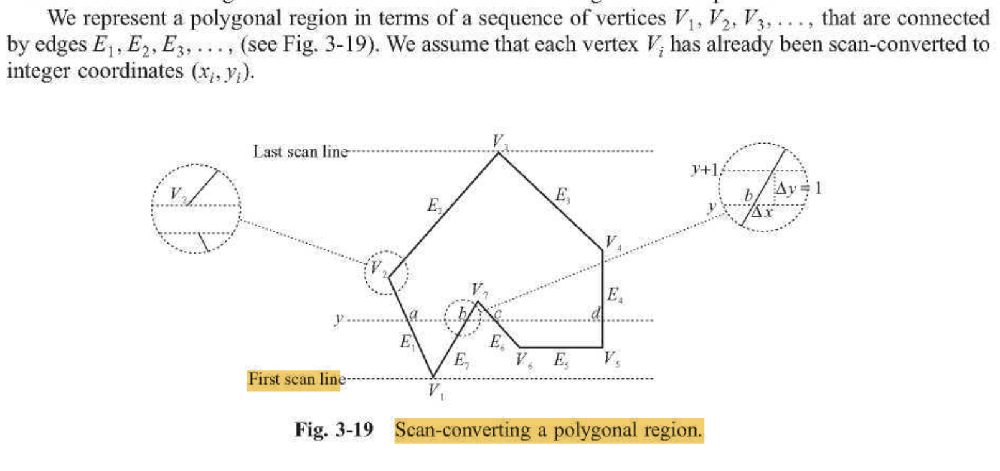

**Fig. 3-19:** Scan-converting a polygonal region.

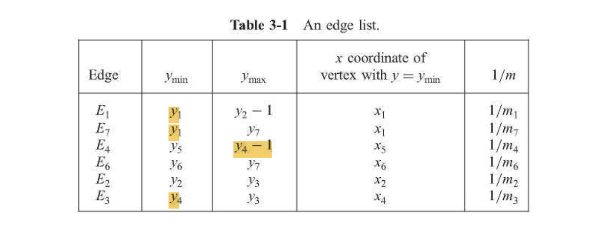

**Table 3-1:** An edge list for scanline fill.

Fills row-by-row using the polygon's geometric edge data. Eliminates recursion.

**Core Concepts:**

| Concept | Explanation |
|---|---|
| **Sweeping Scanline** | Process one horizontal line at a time, bottom to top |
| **Vertex Problem** | Fix: shorten lower edge by 1 ($y_{max} - 1$) at monotonic vertices |
| **Horizontal Rule** | Ignore horizontal edges |
| **Edge Activation Rule** | Edge is active from $y_{min}$ up to (but not including) $y_{max}$; it is deactivated/removed after the scanline at $y_{max}$ is processed. |
| **Odd-Even Rule** | Fill pixels between paired intersection points |
| **Edge Coherence** | $x_{new} = x_{old} + \frac{1}{m}$ — no recalculation per row |


**Algorithm Steps:**
1. **Build Edge Table (ET):** For each non-horizontal edge compute $y_{min}, y_{max}, x, \frac{1}{m}$; apply $y_{max}-1$ rule; sort by $y_{min}$
2. **Initialize:** $y = \min(y_{min})$
3. **Update AEL:** Move edges with $y_{min} = y$ into Active Edge List
4. **Sort AEL** by $x$ (left to right)
5. **Fill:** Pair edges (0&1, 2&3, …); fill between each pair
6. **Remove** edges where $y_{max} = y$
7. **Increment:** $y = y + 1$; update $x_{new} = x + \frac{1}{m}$ for remaining AEL edges
8. **Repeat** until ET and AEL are empty

**Worked Example — Q2(b):** Vertices $(-4,0),(0,2),(4,0),(2,4),(6,4),(0,8),(-6,4),(-4,4)$

**Step 1 — Form edges and discard horizontal ones:**

| Edge | From → To | Horizontal? |
|---|---|---|
| E1 | $(-4,0)\to(0,2)$ | No — keep |
| E2 | $(0,2)\to(4,0)$ | No — keep |
| E3 | $(4,0)\to(2,4)$ | No — keep |
| E4 | $(2,4)\to(6,4)$ | **Yes — discard** |
| E5 | $(6,4)\to(0,8)$ | No — keep |
| E6 | $(0,8)\to(-6,4)$ | No — keep |
| E7 | $(-6,4)\to(-4,4)$ | **Yes — discard** |
| E8 | $(-4,4)\to(-4,0)$ | No — keep |

**Step 2 — Compute ET values** using $\frac{1}{m} = \frac{x_2 - x_1}{y_2 - y_1}$:

- **E1** $(-4,0)\to(0,2)$: $y_{min}=0,\ y_{max}=2,\ x=-4,\ \frac{1}{m}=\frac{0-(-4)}{2-0}=\frac{4}{2}=2$
- **E2** $(0,2)\to(4,0)$: $y_{min}=0,\ y_{max}=2,\ x=4,\ \frac{1}{m}=\frac{4-0}{0-2}=\frac{4}{-2}=-2$
- **E3** $(4,0)\to(2,4)$: $y_{min}=0,\ y_{max}=4,\ x=4,\ \frac{1}{m}=\frac{2-4}{4-0}=\frac{-2}{4}=-0.5$
- **E5** $(6,4)\to(0,8)$: $y_{min}=4,\ y_{max}=8,\ x=6,\ \frac{1}{m}=\frac{0-6}{8-4}=\frac{-6}{4}=-1.5$
- **E6** $(0,8)\to(-6,4)$: $y_{min}=4,\ y_{max}=8,\ x=-6,\ \frac{1}{m}=\frac{-6-0}{4-8}=\frac{-6}{-4}=1.5$
- **E8** $(-4,4)\to(-4,0)$: $y_{min}=0,\ y_{max}=4,\ x=-4,\ \frac{1}{m}=\frac{-4-(-4)}{0-4}=\frac{0}{-4}=0$

**Step 3 — Final Edge Table (sorted by $y_{min}$):**

| Edge | $y_{min}$ | $y_{max}$ | $x$ at $y_{min}$ | $1/m$ |
|---|---|---|---|---|
| E1 | 0 | 2 | −4 | 2 |
| E2 | 0 | 2 | 4 | −2 |
| E3 | 0 | 4 | 4 | −0.5 |
| E8 | 0 | 4 | −4 | 0 |
| E5 | 4 | 8 | 6 | −1.5 |
| E6 | 4 | 8 | −6 | 1.5 |

**Step 4 — Initialize:** $y = 0$ (smallest $y_{min}$)

---

**Scanline $y = 0$:**
- AEL: add E1, E2, E3, E8 (all have $y_{min} = 0$)
- Sort AEL by $x$: $-4\ (\text{E8}),\ -4\ (\text{E1}),\ 4\ (\text{E3}),\ 4\ (\text{E2})$
- Pair (E8,E1) → fill from $-4$ to $-4$ → zero width, **no fill**
- Pair (E3,E2) → fill from $4$ to $4$ → zero width, **no fill**
- No edges have $y_{max} = 0$, so none are removed
- Update $x$ values: $x_{new} = x_{old} + \frac{1}{m}$

| Edge | Old $x$ | $1/m$ | New $x$ |
|---|---|---|---|
| E1 | −4 | 2 | $-4 + 2 = -2$ |
| E2 | 4 | −2 | $4 + (-2) = 2$ |
| E3 | 4 | −0.5 | $4 + (-0.5) = 3.5$ |
| E8 | −4 | 0 | $-4 + 0 = -4$ |

---

**Scanline $y = 1$:**
- No new edges enter AEL
- AEL sorted by updated $x$: $-4\ (\text{E8}),\ -2\ (\text{E1}),\ 2\ (\text{E2}),\ 3.5\ (\text{E3})$
- Pair (E8, E1) → **fill from $x = -4$ to $x = -2$** ✔
- Pair (E2, E3) → **fill from $x = 2$ to $x = 3.5$** ✔
- Update $x$ values:

| Edge | Old $x$ | $1/m$ | New $x$ |
|---|---|---|---|
| E1 | −2 | 2 | $-2 + 2 = 0$ |
| E2 | 2 | −2 | $2 + (-2) = 0$ |
| E3 | 3.5 | −0.5 | $3.5 - 0.5 = 3$ |
| E8 | −4 | 0 | $-4 + 0 = -4$ |

---

**Scanline $y = 2$:**
- Remove E1 and E2 ($y_{max} = 2 = y$)
- AEL now: E3, E8 (sorted: $-4,\ 3$)
- **Fill from $x = -4$ to $x = 3$** ✔
- Update:

| Edge | Old $x$ | $1/m$ | New $x$ |
|---|---|---|---|
| E3 | 3 | −0.5 | $3 - 0.5 = 2.5$ |
| E8 | −4 | 0 | $-4$ |

---

**Scanline $y = 3$:**
- AEL: E3, E8 (sorted: $-4,\ 2.5$)
- **Fill from $x = -4$ to $x = 2.5$** ✔
- Update: E3 → $2.5 - 0.5 = 2$; E8 → $-4$

---

**Scanline $y = 4$:**
- Remove E3 and E8 ($y_{max} = 4 = y$)
- Add E5 and E6 from ET ($y_{min} = 4$)
- AEL: E5 $(x=6)$, E6 $(x=-6)$ → sorted: $-6,\ 6$
- **Fill from $x = -6$ to $x = 6$** ✔
- Update: E5 → $6 - 1.5 = 4.5$; E6 → $-6 + 1.5 = -4.5$

*(Continue similarly for $y = 5, 6, 7$ until $y = 8$ where E5 and E6 are removed and both ET and AEL are empty.)*

| ✅ Advantage | ❌ Disadvantage |
|---|---|
| No recursion | ET and AEL maintenance overhead |
| Fast via edge coherence | AEL re-sort needed when edges cross |
| Handles concave polygons & holes | |

**Common Mistakes:**
- Including horizontal edges in ET
- Forgetting to sort AEL by $x$ each scanline
- Calculating $\frac{1}{m}$ as $\frac{\Delta y}{\Delta x}$ instead of $\frac{\Delta x}{\Delta y}$
- Forgetting $y_{max} - 1$ rule at monotonic vertices

---

## Anti-Aliasing

### Aliasing Artifacts
- Visual distortions caused by approximating continuous objects with discrete pixels.

| Artifact | Description |
|---|---|
| **Staircase (Jaggies)** | Jagged edges on diagonal lines/curves |
| **Unequal Brightness** | Diagonals appear dimmer than horizontal/vertical lines. Because distance between two diagonal pixel is larger |
| **Picket Fence Problem** | When an object does not fit into, the pixel grid properly |
| **Edge Flickering** | Edge vibrate during animation |
| **Moire Pattern** | Interferance occur when high frequency texture are sampled |


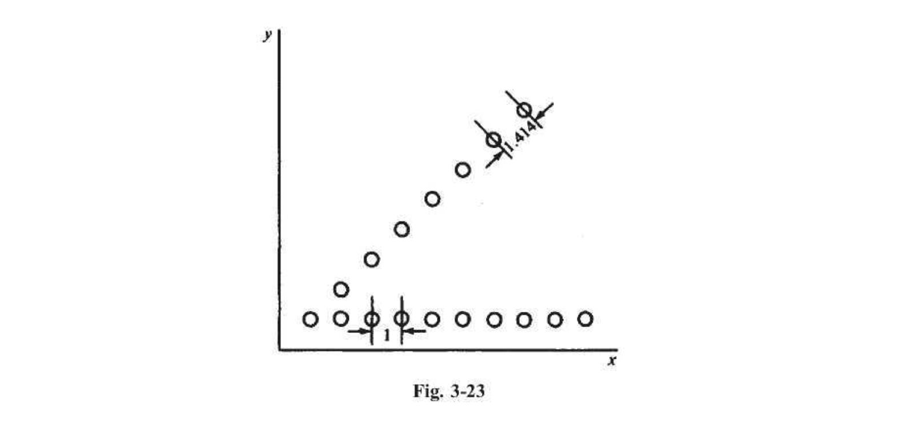

**Fig.:** Unequal Brightness

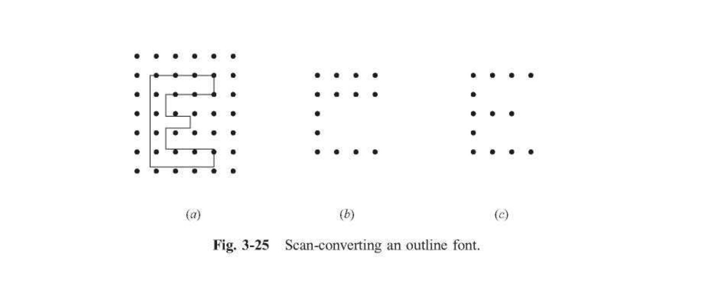

**Fig.:** Picket Fence Problem with the outline font.
Suppose we want to scan-convert the uppercase character "E" in (a) from its outline description to a bitmap consisting of pixels inside the region defined by the outline. The result in (b) exhibits both asymmetry (the upper arm of the character is twice as thick as the other parts) and dropout (the middle arm is absent). A slight adjustment and/or realignment of the outline can lead to a reasonable outcome (c).</div>

### **. Why Anti-Aliasing is Needed**

* Simply increasing resolution reduces jaggedness but **requires a lot of memory and processing**.
* Anti-aliasing **smooths edges without increasing resolution**, making images appear natural.

---

### **. Main Anti-Aliasing Techniques with Examples**

#### **A. Pre-Filtering**

* Works **before converting to pixels**.
* Each pixel’s color is set **based on how much of it is covered by the object**.

**Example:**

* Pixel partially covered by a white line:

    Coverage = 50% (0.5)
    Object color = White (1)
    Background color = Black (0)
    Pixel color = 1 × 0.5 + 0 × 0.5 = 0.5 → gray
* Fully inside pixel → full white, outside → black.

**Result:** Smooth edge; shape remains sharp in the center.

---

#### **B. Supersampling (Post-Filtering)**

* Each pixel is divided into **subpixels** (e.g., 3×3).
* Count subpixels inside the object → average their colors → final pixel color.

**Example:**

* Pixel divided into 3×3 = 9 subpixels
* 6 subpixels are inside a line → coverage = 6/9 ≈ 0.67
* Object color = white (1), background = black (0)
* Pixel color = 1 × 0.67 + 0 × 0.33 = 0.67 → gray

**Visual Idea:**


  [• • •]
  [• o o]
  [o o o]

* `•` = subpixel inside object
* `o` = subpixel outside object
* Coverage = 6/9 → pixel color 0.67 (blended)

**Result:** Smooth diagonal lines and edges.

---

#### **C. Pixel Phasing**

* Hardware-based: shifts pixels **slightly from their normal positions** to align with true line/contour.
* Reduces stair-step effect without blurring edges.

**Example:**

* A diagonal line across a pixel grid may look jagged.
* Pixel positions are shifted **fractionally toward the line**, so the line looks smoother.

**Visual Idea (simplified):**


  Before:   After:
  • o       • •
  o •       o •

* Line edges appear aligned → stair-step effect minimized.

---

#### **D. Gray-Level / Color Blending**

* Uses **intermediate shades or colors** between object and background.
* Only edge pixels are blended, making transitions smooth.

**Example:**

* White line on black background
* Edge pixel = 50% covered → gray
* Edge pixel = 25% covered → dark gray

**Visual Idea:**

```
Background → Dark Gray → Gray → White (center of line)
```

**Result:** Human eye sees a smooth, continuous line.


---
**In short:**
Anti-aliasing tricks your eyes by **blending colors, averaging sub-pixels, or shifting pixels slightly**, so edges appear **smooth and natural**, even on low-resolution screens.

### Chapter 4: Two-Dimensional Transformations

**Introduction**
Transformation is the mathematical process of simulating the spatial manipulation of objects. There are two primary viewpoints for transformations:
1.  **Geometric Transformation:** The coordinate system remains stationary, and the object itself is moved or altered.
2.  **Coordinate Transformation:** The object remains stationary, and the coordinate system is moved or altered around it.

**4.1 Geometric Transformations**
This section defines the fundamental operations for manipulating a point $P(x,y)$ to a new position $P'(x',y')$:
* **Translation ($T_v$):** Displacing an object by a specific distance and direction using a vector. 
    * $x' = x + t_x$ and $y' = y + t_y$

    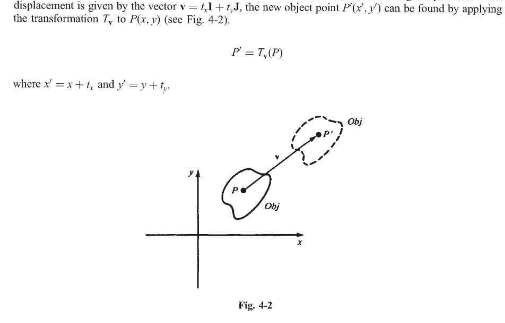

    **Fig. 4-2:** Translation of an object by vector $\vec{v}$, moving point $P$ to $P'$.
* **Rotation ($R_\theta$):** Rotating an object $\theta^\circ$ about the origin. Counterclockwise is positive, and clockwise is negative.
    * $x' = x\cos\theta - y\sin\theta$ and $y' = x\sin\theta + y\cos\theta$

    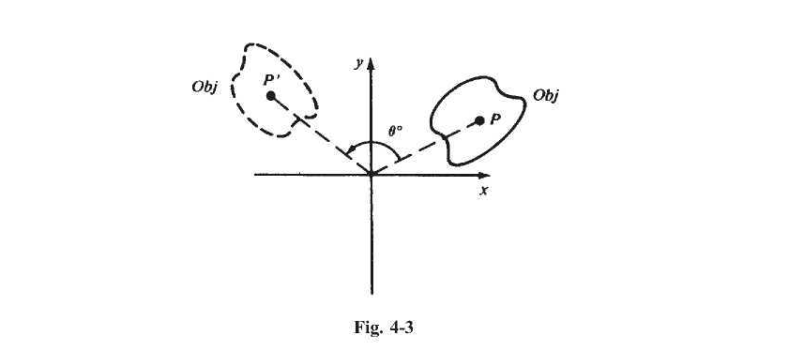

    **Fig. 4-3:** Rotation of an object by $\theta$ degrees, moving point $P$ to $P'$.
* **Scaling ($S_{s_x, s_y}$):** Expanding or compressing an object using scaling constants $s_x$ and $s_y$. Only the origin remains fixed. Uniform scaling occurs when $s_x = s_y$.
    * $x' = s_x x$ and $y' = s_y y$

    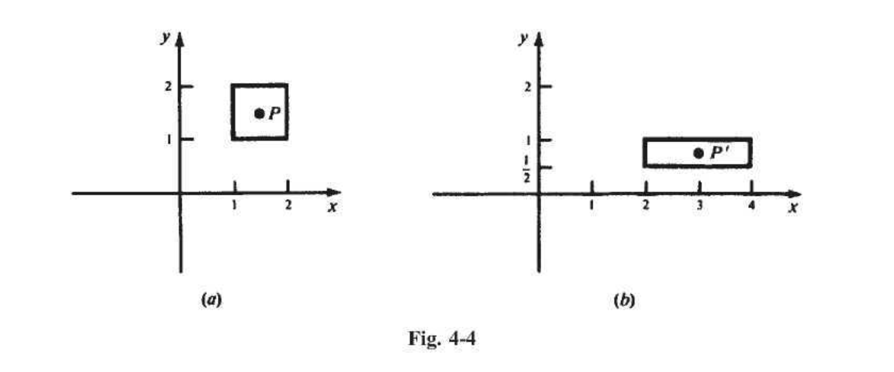

    **Fig. 4-4:** scaling transformation with scaling factors $s_x = 2$ and $s_y = 1/2$.
* **Mirror Reflection ($M$):** Creating a mirrored image of an object across an axis (e.g., about the x-axis: $x' = x$ and $y' = -y$).

  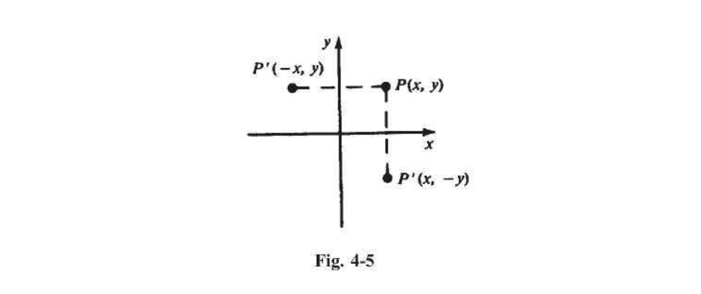

  **Fig. 4-5:** Mirror reflection of a point $P(x, y)$ across the x-axis and y-axis, resulting in $P'(x, -y)$ and $P'(-x, y)$.

    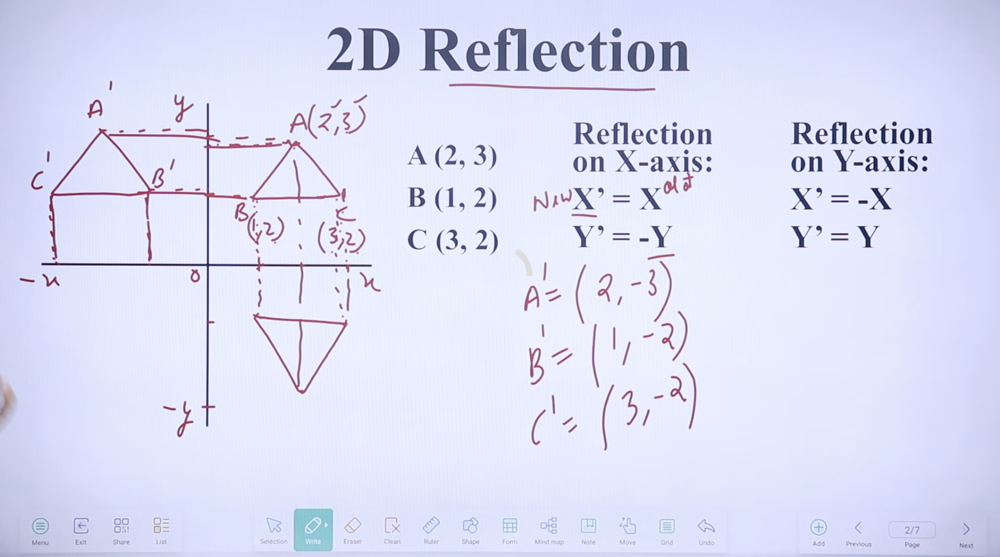

    **Fig. 4-5b:** Example of 2D reflection of a triangle about the x-axis and y-axis, showing coordinate changes and formulas for both axes.
* **Inverse Transformations:** Every geometric transformation has a direct inverse that reverses the operation (e.g., the inverse of translating by $v$ is translating by $-v$).

  - **Translation:** $T_{-v}$ is the inverse of $T_v$ (translation by $-v$ reverses translation by $v$).
  - **Rotation:** $R_{-\theta}$ is the inverse of $R_{\theta}$ (rotation by $-\theta$ undoes rotation by $\theta$).
  - **Scaling:** $S_{1/s_x, 1/s_y}$ is the inverse of $S_{s_x, s_y}$ (scaling by the reciprocal factors undoes the original scaling).
  - **Mirror Reflection:** The inverse of a mirror reflection is itself (applying the same reflection twice returns the object to its original position).

---

#### 2D Shearing

Shearing is a transformation that slants the shape of an object. It is similar to how normal text becomes italicized. Shearing can be performed along the x-axis or y-axis, and the equations change depending on which axis is being tilted.

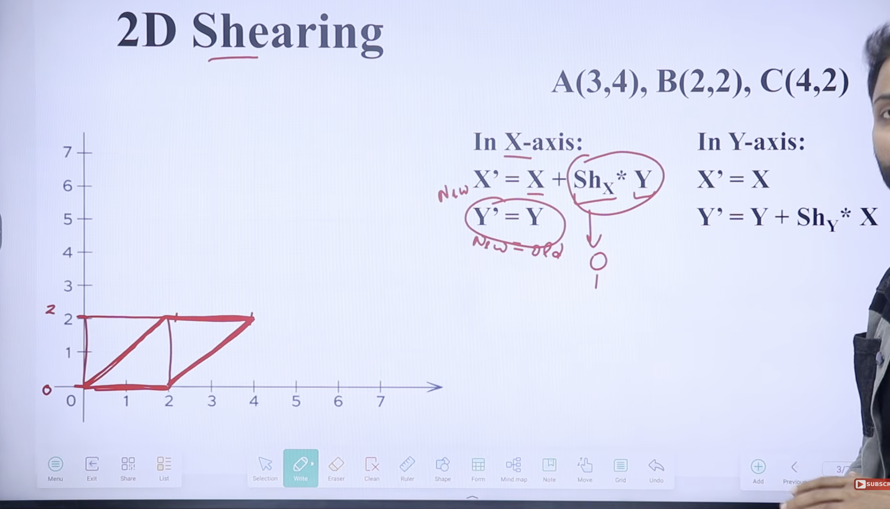

**Fig. 4-6:** Shearing a triangle along the X-axis. The $x$ coordinates are updated as $x' = x + Sh_x \cdot y$ while $y$ remains unchanged.

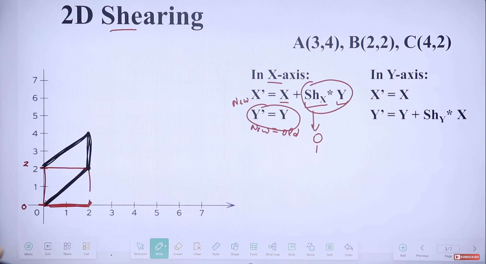

**Fig. 4-7:** Shearing a triangle along the Y-axis. The $y$ coordinates are updated as $y' = y + Sh_y \cdot x$ while $x$ remains unchanged.

**1. Shearing along the X-axis:**
* $x' = x + (Sh_x \cdot y)$
* $y' = y$

**2. Shearing along the Y-axis:**
* $x' = x$
* $y' = y + (Sh_y \cdot x)$

**Key Point:** The axis not mentioned in the question is the one that remains fixed.

**Practical Example:**
Given triangle vertices $A(3,4)$, $B(2,2)$, $C(4,2)$:

*For X-axis Shearing ($Sh_x = 1$):*
  - $A':\ x' = 3 + (1 \times 4) = 7 \rightarrow (7, 4)$
  - $B':\ x' = 2 + (1 \times 2) = 4 \rightarrow (4, 2)$
  - $C':\ x' = 4 + (1 \times 2) = 6 \rightarrow (6, 2)$

*For Y-axis Shearing ($Sh_y = 1$):*
  - $A':\ y' = 4 + (1 \times 3) = 7 \rightarrow (3, 7)$
  - $B':\ y' = 2 + (1 \times 2) = 4 \rightarrow (2, 4)$
  - $C':\ y' = 2 + (1 \times 4) = 6 \rightarrow (4, 6)$

> The core takeaway: Identify which axis is fixed and apply the corresponding formula.

---

**4.2 Coordinate Transformations**

Instead of modifying the object's points, a new coordinate system ($x'y'$) is defined relative to the old one ($xy$). Transformations (translation, rotation, scaling, and reflection) are applied to the axes, which inversely affects the coordinate descriptions of the stationary points.

**4.3 Composite Transformations & Homogeneous Coordinates**
* **Composition:** Complex transformations are built by stringing together basic transformations. For example, to magnify an object while keeping its center $C(h,k)$ fixed, you must: (1) Translate the object so $C$ is at the origin, (2) Scale it, and (3) Translate it back to its original position.
* **Matrix Representation:** Rotation, scaling, and reflection can be represented as $2 \times 2$ matrices, but translation cannot. 
* **Homogeneous Coordinates:** To allow all transformations (including translation) to be treated as matrix multiplications, points are represented as 3D vectors $[x, y, 1]^T$, and transformations are upgraded to **$3 \times 3$ matrices**.
* **Composite Transformation Matrix (CTM):** Because all basic transformations are now $3 \times 3$ matrices, they can be multiplied (concatenated) together into a single CTM, which is highly computationally efficient. 

**4.4 Instance Transformations**
* **Instances:** A complex picture often uses the same object multiple times (e.g., a wheel on a car). An object is defined once in its own local coordinate system, and an **instance transformation** converts those local coordinates into the master "picture" coordinates. This typically involves scaling, rotating, and translating the object into its proper place.
* **Multilevel/Nested Structures:** Objects can be made of sub-objects (e.g., apples on a branch, branch on a tree). To render these efficiently, instance transformations are concatenated across levels so that the lowest-level object is transformed directly into the final picture coordinates in one step.

Here is an exam-oriented summary of Chapter 5, which focuses on selecting and mapping a portion of a 2D scene onto a display device, along with the algorithms required to trim objects that fall outside the viewing area.

### Chapter 5: Two-Dimensional Viewing and Clipping

**Introduction to Viewing**
* **World Coordinate System (WCS):** The master coordinate system where the entire scene is modeled.
* **Window:** A rectangular region in the WCS used to select the specific portion of the scene to be displayed.
* **Normalized Device Coordinate System (NDCS):** A device-independent coordinate system (typically a $1 \times 1$ unit square) that represents the virtual display area.
* **Viewport:** A specific rectangular sub-region within the NDCS where the contents of the window are mapped.
* **Viewing Transformation:** The overall process of mapping coordinates from the WCS to the physical device. It involves two steps: **Window-to-Viewport mapping** (WCS to NDCS) and **Workstation transformation** (NDCS to actual device/pixel coordinates).

**5.1 Window-to-Viewport Mapping**
* This mapping translates and scales coordinates $(wx, wy)$ from the window to coordinates $(vx, vy)$ in the viewport.
* It operates on the principle of maintaining relative placement (e.g., if a point is dead center in the window, it must be dead center in the viewport).
* **Geometric Distortion:** Occurs if the aspect ratio (width-to-height ratio) of the window does not match the aspect ratio of the viewport, causing objects to stretch or compress.

**5.2 & 5.3 Point and Line Clipping**
Clipping is the computational process of removing the parts of an object that lie outside a specified boundary, known as the clipping window. Only the visible parts inside the window are kept and rendered.
* **Point Clipping:** Simply evaluates if a point's coordinates satisfy $x_{min} \le x \le x_{max}$ and $y_{min} \le y \le y_{max}$.
* **Cohen-Sutherland Line Clipping:**
    * Assigns a **4-bit region code** (Top, Bottom, Right, Left) to each endpoint of a line based on its position relative to the window. (e.g., 0000 means inside).
    * *Trivial Accept:* If both codes are 0000, the line is fully visible.
    * *Trivial Reject:* If the bitwise logical AND of the two codes is not 0000, the line is completely outside.
    * *Candidate:* If neither, the line intersects a boundary. The algorithm iteratively finds the intersection point, clips the outside portion, and re-evaluates the new endpoint's code.
* **Midpoint Subdivision Line Clipping:**
    * Uses a binary search approach. A line spanning the boundary is repeatedly bisected at its midpoint into two segments. Segments are categorized using region codes until they are reduced to pixel-sized visible fragments or discarded as invisible.
* **Liang-Barsky Line Clipping:**
    * A highly efficient algorithm based on the **parametric equation of a line** ($x = x_1 + \Delta x \cdot u$, $y = y_1 + \Delta y \cdot u$, for $0 \le u \le 1$).
    * It calculates the intersection parameter $u$ for all four window boundaries. It tracks the maximum entering $u$ value and the minimum exiting $u$ value to determine the visible segment of the line.

**5.4 Polygon Clipping**
* **Sutherland-Hodgman Algorithm:**
    * A pipeline approach that clips an entire polygon against one window boundary edge at a time.
    * For each polygon edge, it evaluates 4 cases: (1) Both ends inside $\rightarrow$ output 2nd point. (2) Both outside $\rightarrow$ output nothing. (3) Inside to outside $\rightarrow$ output intersection point. (4) Outside to inside $\rightarrow$ output intersection, then 2nd point.
    * *Drawback:* Can produce unwanted "extraneous edges" connecting disjoint parts when a concave polygon is clipped into multiple pieces.
* **Weiler-Atherton Algorithm:**
    * Solves the extraneous edge problem.
    * It works by tracing the border of the subject polygon. When the border exits the clipping window, the algorithm makes a "right turn" to trace the clipping window's border instead. When it re-enters, it turns back to trace the subject polygon. This creates perfectly closed sub-polygons for output.

**5.5 The 2D Graphics Pipeline & Animation Concepts**
* **The Pipeline:** Data flows through sequential stages: *Object Definition $\rightarrow$ Modeling Transformation $\rightarrow$ Viewing Transformation $\rightarrow$ Scan Conversion $\rightarrow$ Frame Buffer Display*.
* **Panning & Zooming:** Panning is achieved by translating the window across the WCS. Zooming is achieved by decreasing (zoom in) or increasing (zoom out) the size of the window relative to the viewport.
* **Double Buffering:** An animation technique using two frame buffers. The system displays one buffer while drawing the next frame invisibly in the second buffer. Once drawn, the buffers are swapped to eliminate screen flicker.
* **Lookup Table Animation:** Also known as color cycling. Instead of redrawing an object to move it, the object is pre-drawn in multiple frames. The lookup table is then updated sequentially to change the colors of the frames from "background color" to "visible color", simulating fast, smooth motion.

### Chapter 6: Three-Dimensional Transformations

**Introduction**
Moving from 2D to 3D graphics requires manipulating objects in three-dimensional space. Just like in 2D, this is achieved through transformations, but it requires upgrading from $3 \times 3$ to **$4 \times 4$ homogeneous coordinate matrices** so that translation, scaling, and rotation can all be combined via matrix multiplication.

**6.1 Geometric Transformations**
This perspective assumes the coordinate system remains stationary while the object itself is moved. 
* **Translation:** Displacing an object by a given distance and direction, prescribed by a 3D vector $V = aI + bJ + cK$. In $4 \times 4$ matrix form, the displacement values $a, b,$ and $c$ occupy the rightmost column.
* **Scaling:** Expanding or compressing an object with respect to the origin using three scale factors: $s_x$, $s_y$, and $s_z$. If the scale factor $s > 1$, it is a magnification; if $s < 1$, it is a reduction.
* **Rotation:** 3D rotation is significantly more complex than 2D rotation. While 2D rotation only requires an angle and a center point, 3D rotation requires an angle ($\theta$) and an **axis of rotation**. 
    * *Canonical Rotations:* These are rotations around one of the standard positive coordinate axes (the x-axis, y-axis, or z-axis). The direction of a positive angle is determined by the right-hand rule with respect to the axis of rotation.
    * *Arbitrary Axis Rotation:* Rotating an object around a non-standard axis requires a sequence of transformations: translating the object to the origin, rotating the axis so it aligns with a standard axis (like the z-axis), performing the desired rotation, and then applying the inverse operations to place the object back.

**6.2 Coordinate Transformations**
This perspective assumes the object remains perfectly stationary while the observer (or the coordinate system) is moved around it. 
* Calculating the new coordinates of an object relative to the shifted observer is mathematically equivalent to applying the **inverse** geometric transformation to the object. (e.g., If the observer moves 5 units forward, it is mathematically identical to the object moving 5 units backward).

**6.3 Composite Transformations**
* Complex movements are built by stringing together basic transformations (translation, scaling, and rotation) through a process called **composition of functions**, which in computer graphics is handled via matrix multiplication (concatenation).
* Because 3D transformations use $4 \times 4$ matrices, they can all be seamlessly multiplied together to form a single Composite Transformation Matrix (CTM), allowing complex multi-step manipulations to be calculated in a single mathematical step.

**6.4 Instance Transformations**
* In complex 3D scenes, an object (like a chair) is typically modeled only once in its own local "object coordinate space."
* To place multiple copies (instances) of this chair into a master "scene coordinate space," an **instance transformation** is applied. This is a specific composite transformation matrix that scales, rotates, and translates the generic chair into its specific final position, size, and orientation within the room.

Here is an exam-oriented summary of Chapter 7, which introduces the mathematics and fundamental concepts of projecting 3D objects onto a 2D display surface.
# Chapter 7: Mathematics of Projection

## 1. What is Projection?

Projection is the process of **mapping a 3D point P(x, y, z) onto a 2D image point P′(x′, y′, z′)** on a flat surface called the **projection plane** (or **view plane**).

It acts as a bridge between the 3D world and the 2D display on a screen or paper.

The mapping is done through a line called a **projector** — it passes through the 3D object point and intersects the view plane. The intersection point is the projected image P′.

> **Key Observation:** Projection preserves lines. The image of a line segment is itself a line segment (or a point), never a curve.

---

## 2. Key Elements of Projection
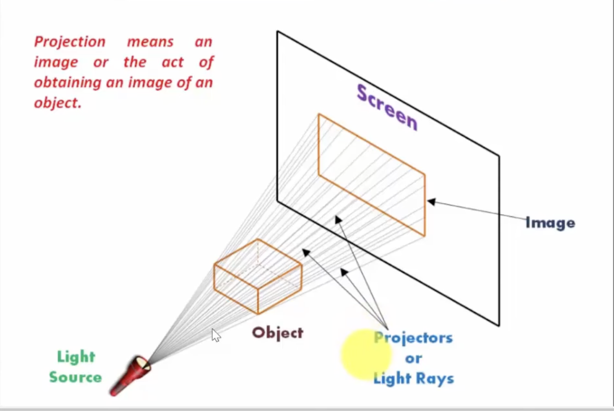
Four components are always needed:

| Component | Description |
|---|---|
| **Observer / COP** | The viewpoint or Center of Projection where projection rays originate |
| **Object** | The 3D entity being projected |
| **Projection Plane (View Plane)** | The 2D surface where the final image forms |
| **Projectors** | The rays/lines that travel from the object toward the projection plane |

---

## 3. Taxonomy of Projection

**Perspective Projection:**

* A method of projecting 3D points onto a plane **so that projection lines converge at a point (the eye/COP)**, making distant objects appear smaller.

**Parallel Projection:**

* A method of projecting 3D points onto a plane **using parallel lines**, so object sizes remain unchanged regardless of distance.

---
```
Projections
├── Perspective  (converging projectors — COP at finite distance)
│   ├── One-point perspective    (1 principal vanishing point)
│   ├── Two-point perspective    (2 principal vanishing points)
│   └── Three-point perspective  (3 principal vanishing points)
│
└── Parallel  (parallel projectors — COP at infinity)
    ├── Orthographic  (projectors perpendicular to view plane)
    │   ├── Multiview    (view plane parallel to principal planes)
    │   └── Axonometric  (view plane NOT parallel to principal planes)
    │       ├── Isometric   (equal angles with all 3 axes)
    │       ├── Dimetric    (equal angles with exactly 2 axes)
    │       └── Trimetric   (unequal angles with all 3 axes)
    │
    └── Oblique  (projectors NOT perpendicular to view plane)
        ├── Cavalier  (lines perpendicular to view plane at full length)
        └── Cabinet   (lines perpendicular to view plane at half length)
```

**Core difference:**

| | Perspective | Parallel |
|---|---|---|
| COP location | Finite point | At infinity |
| Projectors | Converge at COP | All parallel |
| Realism | High (mimics the eye/camera) | Low |
| Preserves measurements | No | Yes |
| Parallel lines stay parallel? | No — converge at vanishing points | Yes |
| Used for | Artistic/realistic rendering | Engineering/architectural drawings |

---

## 4. Perspective Projection

In perspective projection, all projectors **converge at a single point** — the **Center of Projection (COP)**, analogous to the eye or camera lens.

A perspective transformation is fully defined by two things:
1. The **COP** — where the rays start from
2. The **View Plane** — defined by a reference point R₀ and a normal vector N
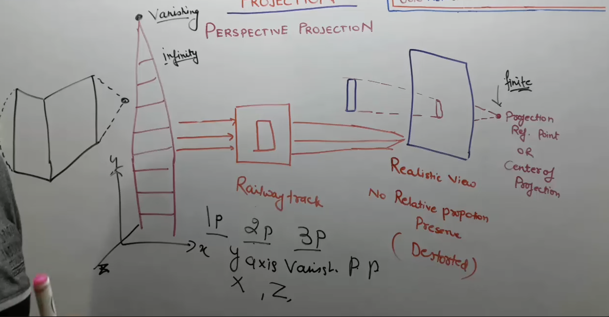

---

### 4.1 Reference Point R₀ and Normal Vector N

**What is the Reference Point R₀?**

R₀ is a known point that lies on the view plane. It acts as the **base location** from which the plane's position in 3D space is defined.

- Think of it as: **the origin of the viewing coordinate system** — the anchor point of the camera/view setup.
- Every projected point P′ is calculated relative to this reference.
- It is used to write the plane equation: any point P′ is on the plane if the vector (P′ − R₀) is perpendicular to N.

**What is the Normal Vector N?**

The normal vector N = (n₁, n₂, n₃) is a vector that is **perpendicular (at 90°) to the plane**.

```
        ^ N  (normal vector — sticks straight out of the plane)
        |
  ------+------
 /             \
/   VIEW PLANE  \
```

Why the normal matters:
- It defines the **orientation (tilt)** of the view plane in 3D space.
- Without N, we cannot tell if the plane faces left, right, up, or diagonally.
- Combined with R₀, it fully describes the plane mathematically.

**Plane Equation from R₀ and N:**

A point P′(x′, y′, z′) lies on the plane if and only if:

```
N · (P′ − R₀) = 0
```

Expanding:

```
n₁(x′ − x₀) + n₂(y′ − y₀) + n₃(z′ − z₀) = 0
n₁x′ + n₂y′ + n₃z′ = n₁x₀ + n₂y₀ + n₃z₀
```

Define the constant:

```
D = n₁x₀ + n₂y₀ + n₃z₀
```

So the plane equation becomes:

```
n₁x′ + n₂y′ + n₃z′ = D
```

> Left side depends on any candidate point P′. Right side D is a fixed constant for the plane.  
> Any point P′ lies on the plane if and only if it satisfies this equation.

---

### 4.2 General Perspective — COP at Origin, Arbitrary Plane

**Setup:**
- COP at origin (0, 0, 0)
- View plane defined by normal N = (n₁, n₂, n₃) and reference point R₀(x₀, y₀, z₀)
- Object point: P(x, y, z)
- Find: projected point P′(x′, y′, z′)
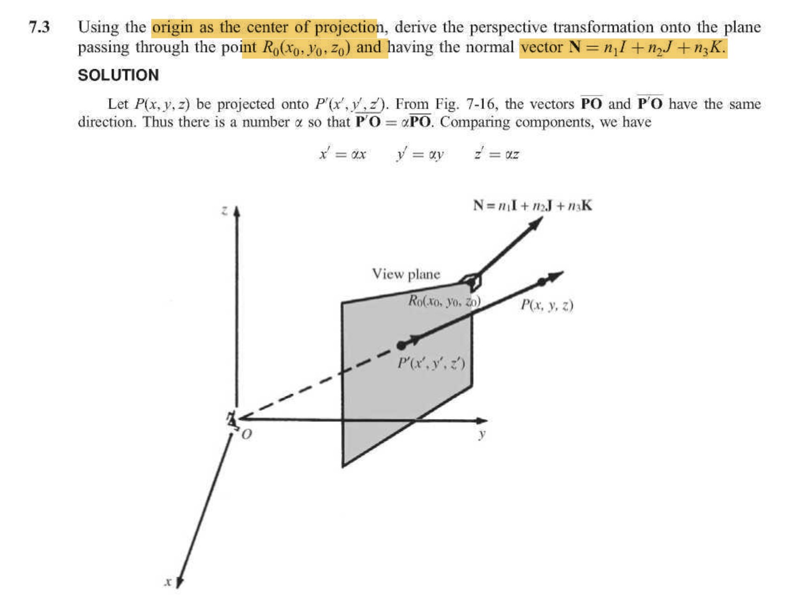


**Step 1 — Ray from COP through P:**

Since the COP is the origin and the ray passes through P, any point on this ray is a scalar multiple of P:

```
P′ = α · P   →   x′ = αx,   y′ = αy,   z′ = αz
```

(α is an unknown scalar to be determined.)

**Step 2 — P′ must lie on the plane:**
So, it it shoudl satisfy the plane equation n₁x′ + n₂y′ + n₃z′ = D

```
n₁(αx) + n₂(αy) + n₃(αz) = D
α(n₁x + n₂y + n₃z) = D
α = D / (n₁x + n₂y + n₃z)
```

**Step 3 — Substitute α back to get projection formulas:**

```
x′ = Dx / (n₁x + n₂y + n₃z)
y′ = Dy / (n₁x + n₂y + n₃z)
z′ = Dz / (n₁x + n₂y + n₃z)
```

where `D = n₁x₀ + n₂y₀ + n₃z₀`.

**Step 4 — Matrix form using homogeneous coordinates:**

```
| D   0   0   0 |   | x |   | Dx                    |
| 0   D   0   0 | × | y | = | Dy                    |
| 0   0   D   0 |   | z |   | Dz                    |
| n₁  n₂  n₃  0 |   | 1 |   | n₁x + n₂y + n₃z      |
```

Divide each of the first three results by the last (perspective divide) to recover x′, y′, z′.

---

### 4.3 Standard Perspective — COP at Origin, View Plane z = d

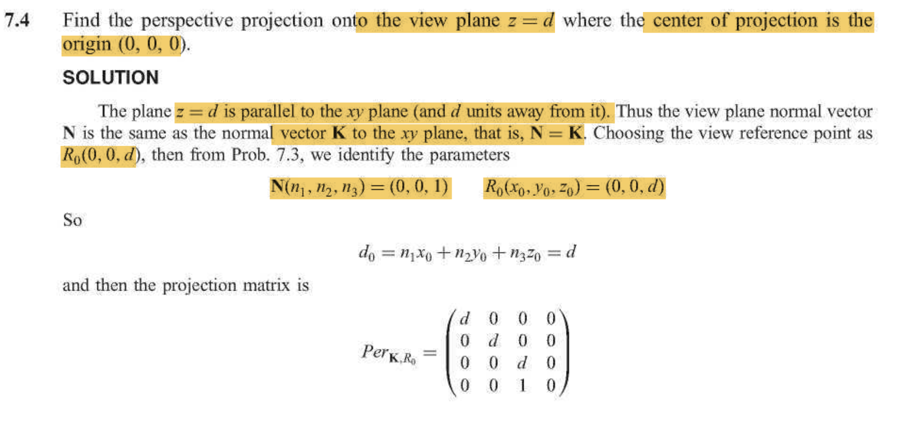

This is a **special case** of Section 4.2 where the plane is z = d.

- Normal: N = (0, 0, 1)
- Reference point: R₀ = (0, 0, d)

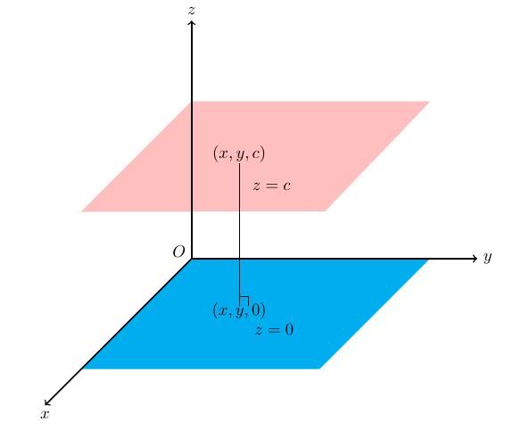

**Compute D:**

```
D = (0)(0) + (0)(0) + (1)(d) = d
```

**Substitute into general formulas:**

```
x′ = dx / (0·x + 0·y + 1·z) = dx/z
y′ = dy/z
z′ = d
```

**Result:**

```
x′ = dx/z,   y′ = dy/z,   z′ = d
```

**Matrix (homogeneous):**

```
| d   0   0   0 |
| 0   d   0   0 |
| 0   0   0   0 |
| 0   0   1   0 |
```

Apply to (x, y, z, 1) → result is (dx, dy, 0, z). Divide by z → x′ = dx/z, y′ = dy/z.

---

### 4.4 Standard Perspective — COP at C(0, 0, −d), View Plane = xy-plane

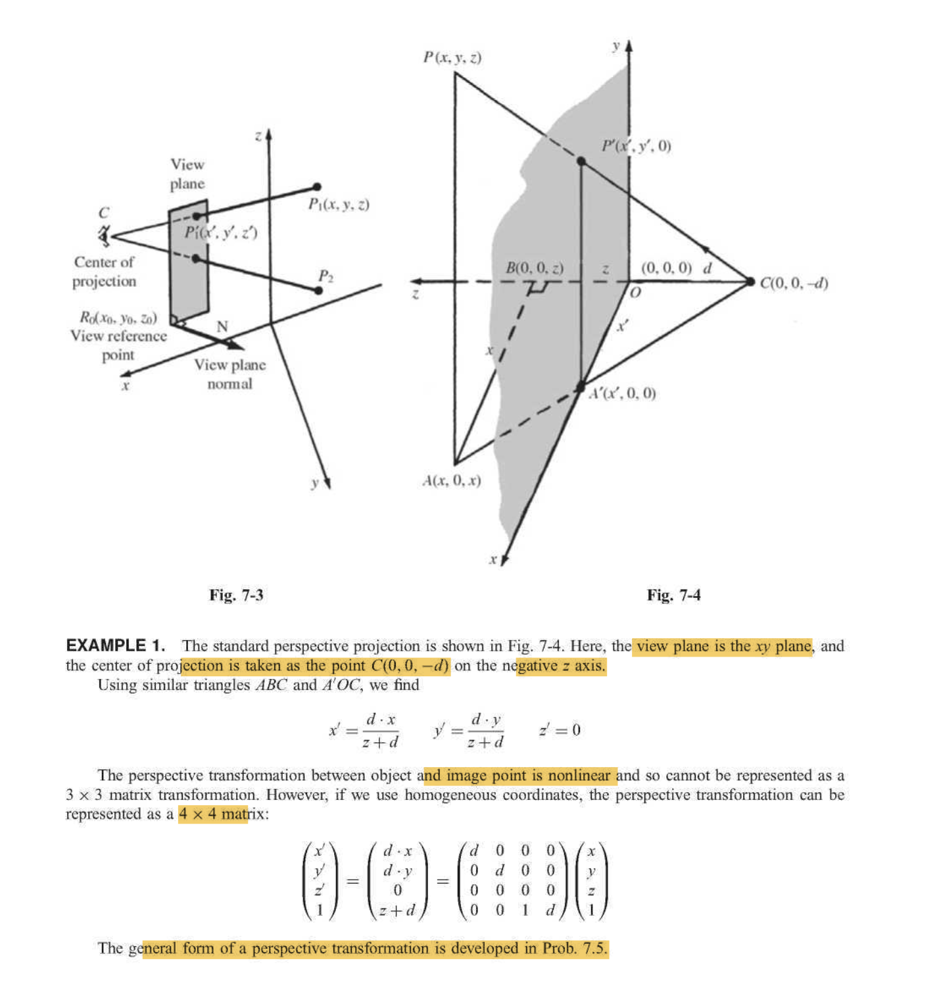
Here the view plane is z = 0 (the xy-plane) and the COP is at C(0, 0, −d).

**Step 1 — Ray from C(0, 0, −d) through P(x, y, z):**

```
Point on ray = C + t(P − C) = (tx,  ty,  −d + t(z+d))
```

**Step 2 — Find t when z-coordinate = 0 (hits the xy-plane):**

```
−d + t(z + d) = 0   →   t = d / (z + d)
```

**Step 3 — Projected coordinates:**

```
x′ = tx = dx / (z + d)
y′ = ty = dy / (z + d)
z′ = 0
```

**Result:**

```
x′ = dx/(z+d),   y′ = dy/(z+d),   z′ = 0
```

---

### 4.5 Why a 3×3 Matrix Cannot Work — Homogeneous Coordinates

**The problem:**

From the general perspective result:

```
x′ = Dx / (n₁x + n₂y + n₃z)
```

The denominator `(n₁x + n₂y + n₃z)` contains the input variables x, y, z — we are **dividing by a function of the input**. That is a **non-linear** operation.

A 3×3 matrix can only represent **linear transformations** (rotation, scaling, shearing). It cannot handle this division. So perspective projection cannot be expressed as a 3×3 matrix multiplication.

| Without homogeneous coords | With homogeneous coords |
|---|---|
| Non-linear — no matrix possible | Linear 4×4 matrix + one final division |
| Cannot combine with other transforms | Transforms chain by matrix multiplication |
| Not GPU-friendly | Standard in graphics hardware pipelines |

**The fix — Homogeneous Coordinates:**

Extend (x, y, z) to (x, y, z, 1) by adding an extra coordinate.

The 4×4 matrix encodes the numerators in the top rows and the denominator expression in the bottom row:

```
| D   0   0   0 |
| 0   D   0   0 |
| 0   0   D   0 |
| n₁  n₂  n₃  0 |
```

After multiplying by (x, y, z, 1), the result is (Dx, Dy, Dz, n₁x+n₂y+n₃z).

**Perspective divide:** divide by the last component to get x′, y′, z′.

> The division happens *after* the matrix multiplication — not inside it. This is the key trick that makes a non-linear operation GPU-compatible.

---

### 4.6 Perspective Anomalies

The perspective process introduces **four distinct visual anomalies**:

**1. Perspective Foreshortening**
Objects appear progressively smaller as their distance from the COP increases. Enhances depth cues but distorts actual sizes.

**2. Vanishing Points**
Sets of parallel 3D lines that are **not parallel to the view plane** appear to converge at a single point on the view plane called a vanishing point.
- Example: parallel railway tracks appear to meet at the horizon.
- **Principal vanishing points** are formed by lines parallel to the x, y, or z axes.
- The number of principal vanishing points equals the number of principal axes the view plane intersects (gives 1-point, 2-point, or 3-point perspective).

**3. View Confusion**
Points **behind the COP** get projected upside-down and backward onto the view plane. This is why 3D clipping must happen *before* applying the perspective transformation.

**4. Topological Distortion**
The plane passing through the COP and parallel to the view plane is a singularity. Any point on it projects to infinity. A finite line segment crossing this plane is torn into two disconnected, infinitely long halves.

---

## 5. Parallel Projection

In parallel projection, all projectors are **parallel to each other** — the COP is conceptually at infinity. A fixed **direction of projection vector V = (a, b, c)** governs all projectors.

Preserves true dimensions, shapes, and parallel relationships — hence the standard in engineering drafting.

---

### 5.1 General Parallel Projection onto the xy-Plane

**Setup:** Project P(x, y, z) onto the xy-plane (z = 0) along direction V = (a, b, c).

**Step 1 — The projector through P is parallel to V:**

```
(x′, y′, z′) = (x + at,  y + bt,  z + ct)
```

**Step 2 — Apply the plane condition z′ = 0:**

```
0 = z + ct   →   t = −z/c
```

**Step 3 — Substitute t:**

```
x′ = x + a(−z/c) = x − (a/c)z
y′ = y + b(−z/c) = y − (b/c)z
z′ = 0
```

**Result:**

```
x′ = x − (a/c)z
y′ = y − (b/c)z
z′ = 0
```

**Matrix form (3×3):**

```
| 1   0   −a/c |   | x |   | x − (a/c)z |
| 0   1   −b/c | × | y | = | y − (b/c)z |
| 0   0    0   |   | z |   | 0           |
```

> This is a **linear** transformation — no division by input variables — so a 3×3 matrix works perfectly here. This is why parallel projection is simpler computationally than perspective.

---

### 5.2 Orthographic Projection onto xy-Plane

Special case of parallel projection where V = (0, 0, 1) — the projection direction is perpendicular to the xy-plane.

Substitute a = 0, b = 0 into the general result:

```
x′ = x − (0/c)z = x
y′ = y − (0/c)z = y
z′ = 0
```

**Result:**

```
x′ = x,   y′ = y,   z′ = 0
```

**Matrix form:**

```
| 1   0   0   0 |
| 0   1   0   0 |
| 0   0   0   0 |
| 0   0   0   1 |
```

This simply **drops the z-coordinate** — the simplest possible projection.

---

### 5.3 Oblique Projection

Oblique projection is a parallel projection where V is **not perpendicular** to the view plane (not parallel to the normal N).

The derivation is identical to Section 5.1. The distinction is:
- V is parallel to N → **Orthographic**
- V is not parallel to N → **Oblique**

Two standard oblique subtypes (view plane = xy-plane):

| Type | Lines perpendicular to view plane | Effective angle |
|---|---|---|
| **Cavalier** | Drawn at **full (1:1) length** — no foreshortening | ~45° |
| **Cabinet** | Drawn at **half (1:2) length** — foreshortened 50% | ~63.4° (arctan 2) |

Cabinet looks more natural because the human eye perceives full-length receding lines as unrealistically long.

---

## 6. Named Projection Types — Quick Definitions

| Name | Family | Key Characteristic |
|---|---|---|
| **Isometric** | Axonometric Orthographic | Equal angles with all 3 principal axes. All 3 axes foreshortened equally (~0.816). Projected angles between axes = 120°. |
| **Dimetric** | Axonometric Orthographic | Equal angles with exactly 2 of the 3 axes. Those 2 share one foreshortening ratio; the third is different. |
| **Trimetric** | Axonometric Orthographic | Unequal angles with all 3 axes. All three foreshortening ratios are different. |
| **Cavalier** | Oblique Parallel | Lines perpendicular to xy-plane drawn at full length. No foreshortening. |
| **Cabinet** | Oblique Parallel | Lines perpendicular to xy-plane drawn at half their actual length. |

---

## 7. Exam Question Bank with Full Answers

---

### Q1. Define view plane and center of projection for standard perspective projection.
*(Dec 2018, Q1.d)*

**View Plane:** The 2D surface onto which the 3D scene is projected to form the image.

**Center of Projection (COP):** The fixed 3D point from which all projection rays originate — like the position of the eye or camera. In the standard setup, the COP is at the origin (0, 0, 0) and the view plane is z = d.

---

### Q2. What are the main differences between perspective and parallel projection?
*(Dec 2018, Q6.b.i)*

| | Perspective | Parallel |
|---|---|---|
| COP location | Finite point | At infinity |
| Projectors | Converge at COP | All parallel |
| Realism | High | Low |
| Foreshortening | Yes | No |
| Parallel lines | Converge at vanishing points | Stay parallel |
| Use case | Rendering/animation | Engineering/architectural drawings |

---

### Q3. While dealing with perspective projection, which components must always be given? Why?
*(Dec 2019, Q1.f)*

You must always have:
1. The **Center of Projection (COP)** — where projection rays originate.
2. The **View Plane** — defined by either its equation (e.g., z = d) or a reference point R₀ and a normal vector N.

**Why:** Perspective projection finds P′ as the intersection of (a) a ray from the COP through P, and (b) the view plane. Without knowing where the ray starts (COP) and what surface it hits (view plane), the intersection cannot be computed.

---

### Q4. Using the origin as the COP, derive the perspective transformation onto the plane through R₀(x₀, y₀, z₀) with normal N = n₁i + n₂j + n₃k.
*(Dec 2018, Q5.f / Dec 2019, Q6.c)*

**Step 1 — Plane equation:**

```
N · (P′ − R₀) = 0   →   n₁x′ + n₂y′ + n₃z′ = D
where D = n₁x₀ + n₂y₀ + n₃z₀
```

**Step 2 — Ray from origin through P:**

```
x′ = αx,   y′ = αy,   z′ = αz
```

**Step 3 — Substitute into plane equation:**

```
α(n₁x + n₂y + n₃z) = D   →   α = D / (n₁x + n₂y + n₃z)
```

**Step 4 — Final transformation:**

```
x′ = Dx / (n₁x + n₂y + n₃z)
y′ = Dy / (n₁x + n₂y + n₃z)
z′ = Dz / (n₁x + n₂y + n₃z)
```

**Step 5 — Why not a 3×3 matrix:** The denominator contains x, y, z — division by input variables is non-linear. A 3×3 matrix only handles linear operations.

**Step 6 — Homogeneous 4×4 matrix:**

```
| D   0   0   0 |
| 0   D   0   0 |
| 0   0   D   0 |
| n₁  n₂  n₃  0 |
```

Multiply by (x, y, z, 1) → get (Dx, Dy, Dz, n₁x+n₂y+n₃z). Divide by last component → gives x′, y′, z′ above.

---

### Q5. Find the perspective projection onto the view plane z = d with COP at origin.
*(Dec 2018, Q4.k / Dec 2021, Q1.e)*

Special case of Q4 with N = (0, 0, 1) and R₀ = (0, 0, d).

Compute D:

```
D = (0)(0) + (0)(0) + (1)(d) = d
```

Apply general formula:

```
x′ = dx / (0·x + 0·y + 1·z) = dx/z
y′ = dy/z
z′ = d
```

Matrix:

```
| d   0   0   0 |
| 0   d   0   0 |
| 0   0   0   0 |
| 0   0   1   0 |
```

Apply to (x, y, z, 1) → (dx, dy, 0, z). Divide by z → x′ = dx/z, y′ = dy/z.

---

### Q6. Under the standard perspective transformation, find: (a) projected image of a point in z = −d, and (b) projected image of segment from P₁(−1, 1, −2d) to P₂(2, −2, 0).
*(Dec 2018, Q2.d / Q6.a)*

Using x′ = dx/z and y′ = dy/z from Q5:

**(a) Point in the plane z = −d:**

```
x′ = dx/(−d) = −x,   y′ = dy/(−d) = −y
```

The point (x, y, −d) projects to **(−x, −y, d)** — the image is inverted. This illustrates **view confusion** (point is behind the COP).

**(b) Segment from P₁(−1, 1, −2d) to P₂(2, −2, 0):**

Project P₁ (z = −2d):

```
x′ = d(−1)/(−2d) = 1/2,   y′ = d(1)/(−2d) = −1/2
```

Projected P₁ = **(1/2, −1/2, d)** ✓

Project P₂ (z = 0):

```
x′ = d(2)/0 = undefined (→ ∞)
y′ = d(−2)/0 = undefined (→ ∞)
```

P₂ lies on the plane z = 0 passing through the COP — its projection goes to infinity.

**Result:** The projected image is a **ray starting at (1/2, −1/2) on the view plane and extending to infinity**. This illustrates **topological distortion**.

---

### Q7. Derive the equations of parallel projection onto the xy-plane in direction V = ai + bj + ck.
*(Dec 2018, Q3.c.i)*

Projector through P(x, y, z) parallel to V:

```
(x′, y′, z′) = (x + at,  y + bt,  z + ct)
```

From z′ = 0:

```
0 = z + ct   →   t = −z/c
```

Substitute:

```
x′ = x − (a/c)z,   y′ = y − (b/c)z,   z′ = 0
```

Matrix form:

```
| 1   0   −a/c |   | x |   | x − (a/c)z |
| 0   1   −b/c | × | y | = | y − (b/c)z |
| 0   0    0   |   | z |   | 0           |
```

---

### Q8. Derive the general form of an oblique projection onto the xy-plane.
*(Dec 2019, Q4.e)*

Oblique projection is a parallel projection where V is not perpendicular to the xy-plane. Since the derivation is identical to Q7 (same direction-of-projection setup), the result is the same:

```
x′ = x − (a/c)z,   y′ = y − (b/c)z,   z′ = 0
```

The condition for oblique (not orthographic) is that at least one of (a, b) is nonzero — meaning V has a component along the plane, not just perpendicular to it.

---

### Q9. What are the anomalies of perspective projection?
*(Dec 2019, Q2.f / Dec 2021, Q6.f)*

1. **Perspective foreshortening** — objects appear smaller with increasing distance from the COP.
2. **Vanishing points** — parallel 3D lines not parallel to the view plane appear to converge on the view plane.
3. **View confusion** — points behind the COP project upside-down and backward onto the view plane.
4. **Topological distortion** — a line crossing the plane through the COP parallel to the view plane is torn into two disconnected infinite halves.

---

### Q10. What is a vanishing point?
*(Dec 2019, Q4.c)*

A vanishing point is a point on the view plane where the 2D projections of a set of mutually parallel 3D lines appear to converge. For example, parallel railway tracks appear to meet at the horizon.

---

### Q11. Define dimetric projection.
*(Dec 2020 Set-01 & Set-02, Q1.e)*

Dimetric projection is an axonometric (orthographic parallel) projection where the direction of projection makes **equal angles with exactly two** of the three principal axes. Those two axes are foreshortened by the same ratio; the third axis has a different foreshortening ratio.

---

### Q12. What is cabinet projection?
*(Dec 2020 Set-02, Q1.e)*

Cabinet projection is an oblique parallel projection where lines perpendicular to the projection plane are drawn at **half (1/2) of their actual length**. The projection rays make an angle of arctan(2) ≈ 63.4° with the view plane. This gives a more natural appearance than cavalier projection.

---

### Q13. What is isometric projection?
*(Dec 2021, Q5.h)*

Isometric projection is an axonometric (orthographic parallel) projection where the direction of projection makes **equal angles with all three** principal axes (x, y, z). All three axes foreshorten equally by a ratio of approximately 0.816. The projected angles between the three axes are all 120°.

---